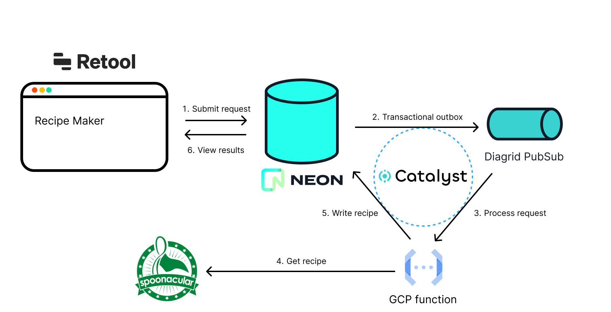

# Recipe Maker Demo App

## Overview

This repository contains the code for a comprehensive demonstration of an event-driven Recipe Maker application. The project showcases the integration of various cloud-native services, including Retool, Google Cloud Functions, Neon database, and Diagrid Catalyst, to create an event-driven architecture.

### Explore the Tutorial

To understand how the different components are connected and learn how to build this application, check out the detailed tutorial in the accompanying blog post. It provides a step-by-step guide to creating an event-driven system using these technologies.

Read the [Blog Post](https://www.diagrid.io/blog/transforming-crud-to-event-driven)

### Watch the Live Demo

See the entire process in action by watching the live demonstration on YouTube. The video illustrates how to transform a conventional CRUD application into an event-driven system.

Watch the [Demo Video](https://youtu.be/zrbXd5FKCe0?t=2147)

## Project Structure

This repository is organized into two main parts:

1. **Retool App Code:** Contains the code for the Retool application that serves as the frontend of the Recipe Maker.

2. **Python Function Code:** Includes the Python function responsible for processing events and fetching recipes from external sources.

## Getting Started

Follow the instructions provided in the blog post to set up and run this event-driven Recipe Maker demo on your own. The tutorial includes detailed steps, configurations, and explanations.

## Contributions

Contributions and improvements are welcome! If you have ideas for enhancements or discover any issues, please open an issue or submit a pull request.

## License

This project is licensed under the Apache License. See the [LICENSE](LICENSE) file for details.

